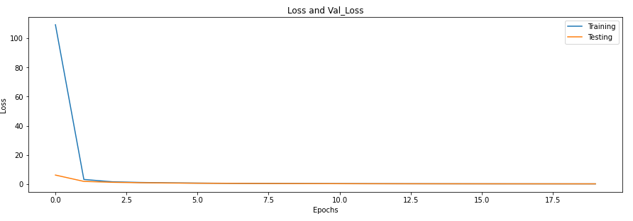
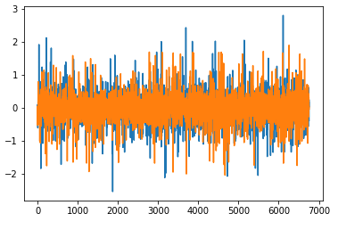
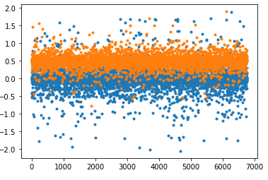
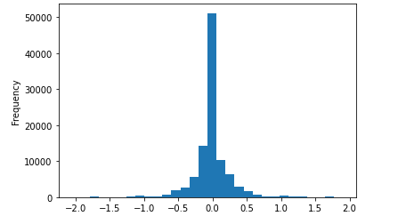
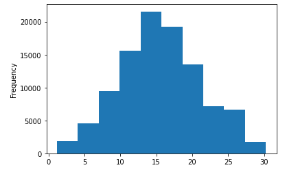
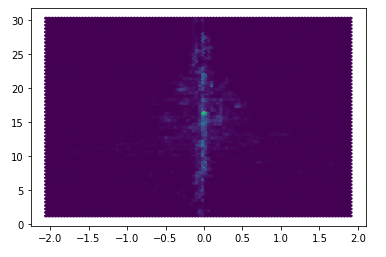
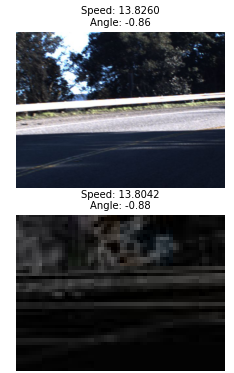
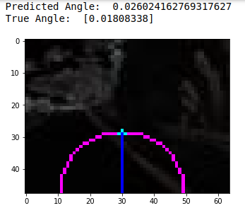

  
  
    

In this project, techniques in DL supervised learning have been applied to predict the vector of
steering angles required to navigate a car through some specified trajectory. The dataset is based from Udacity. [*udacity](https://github.com/udacity/self-driving-car/tree/master/datasets).

Each file in the dataset describes a trajectory (roughly a 15 to 45 minute drive), over the duration
of which attributes are collected. For each point along the trajectory, the steering angle at that
point is recorded along with the GPS coordinates of the car, the instantaneous speed at which the car is traveling, and a set of 3 images {left, center, right} captured by onboard forward facing cameras in the vehicle.

Please **NOTE**: The dataset is too large to upload to github and also some of the cells in the jupyter notebook had to be removed since I am displaying a large number of processed images. 

Steps Involved:  

## image pre-processing
- Read in images and normalize them. Then it will perform central cropping and rescaling to 48 x 64.  
- 
## csv file pre-processing
- Read in the csv file. Looks for the filename column and finds out all the rows containing center or left or right. Then it finds the angle column and concatenates the angle column with the particular camera pictures from the filename. The code also drops any NAs in any of the rows.  

## generation of training and testing sets
- Code below will append all the images from a directory to train_x which is then converted to an array. The code will also convert r from the cells above to an array and assigned to train_y which then gets reshaped.  

## train/test split (80/20)
-The code will split the input data x and y to x train/test and y train/test.  

## model definition
- **Convolution2D** layers are used for the input of an image in 3D (height, width, channels).

At the core of the model we have the dense layers. It is a widely used layer for creating a deeply connected layer in the neural network where each of the neurons of the dense layers receives input from all neurons of the previous layer.

Another used layer is the flatten layer which as its name suggests, it is used for flattening of the input.

The Convolution2D layer is the convolutional layer that performs an operation called a “convolution“.

Convolution is a linear operation that involves the multiplication of a set of weights with the input. This multiplication is performed between an array of input data and a two-dimensional array of weights, called a filter or a kernel.

**In this particular model, the first number which is 12 implies the number of filters to be used for convolution operations. The (3,3) input is the kernel size which dictates the length of the convolution window.**  

The plot below provides a plot of the Training and Testing loss functions from the CNN model. 

 

The figure below provides a plot of the target versus the predicted values for the steering angles.  

 

The figure below provides a plot of the scattered points of the predicted values for the steering angles versus the target ones.  

 

The figure below depicts a histogram plot of the steering angles for all the different frequency of events.  

 

The figure below depicts a histogram plot of the speed for all the different frequency of events.  

 

The figure below depicts a hex bin plot of the steering angles versus speed.  

 

The figure below depicts original and sobel processed frame with speed and angle.  

 

The figure below depicts sobel processed frame with direction of turn.  

 

https://abedinsherifi.github.io/Steering-Angle-Prediction-CNN/
